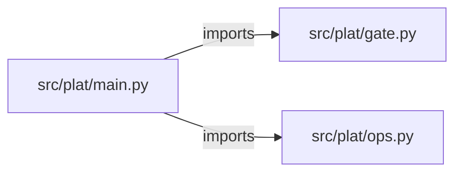

# internal-developer-platform — project architecture

[README](README.md) · [Interview questions and answers](INTERVIEW_QA.md)

## Purpose and scope

Portal request → FastAPI → render Terraform/Helm/Argo files. prod and latest fail. applied false.

This document describes files and symbols in this checkout. Deployment templates and statements in the original overview are distinguished from a verified running environment.

## Component diagram



For Python repositories, arrows show resolved local imports, not network calls or deployment order. Otherwise the diagram is a repository component map; containment arrows do not assert runtime integration.

## Components and responsibilities

| Component | Responsibility |
| --- | --- |
| [`src/plat/main.py`](src/plat/main.py) | HTTP handlers: `GET /healthz`, `POST /check` |
| [`src/plat/ops.py`](src/plat/ops.py) | HTTP handlers: `GET /readyz`, `POST /workspaces`, `GET /workspaces`, `POST /workspaces/{workspace_id}/jobs`, `GET /jobs/{job_id}` |
| [`src/plat/gate.py`](src/plat/gate.py) | Functions: `check` |
| [`requirements.txt`](requirements.txt) | Implementation or supporting configuration |
| [`terraform/main.tf`](terraform/main.tf) | Terraform resource/module declarations |
| [`web/src/App.tsx`](web/src/App.tsx) | User interface code/assets |
| [`Dockerfile`](Dockerfile) | Container build/service configuration |
| [`Makefile`](Makefile) | Implementation or supporting configuration |
| [`docker-compose.yml`](docker-compose.yml) | Container build/service configuration |
| [`tests/test_gate.py`](tests/test_gate.py) | Executable checks and regression examples |
| [`tests/test_ops.py`](tests/test_ops.py) | Executable checks and regression examples |
| [`.github/workflows/ci.yml`](.github/workflows/ci.yml) | GitHub Actions job definitions |
| [`README.md`](README.md) | Project explanations or operating notes |
| [`docs/ARCHITECTURE.md`](docs/ARCHITECTURE.md) | Project explanations or operating notes |

## Existing design and operating guides

These checked-in guides provide the project’s detailed design, operational context, or deployment view:

- [`docs/ARCHITECTURE.md`](docs/ARCHITECTURE.md).

## Request interface

| Method and path | Handler | Source |
| --- | --- | --- |
| `GET /healthz` | `healthz` | [`src/plat/main.py`](src/plat/main.py#L8) |
| `POST /check` | `post_check` | [`src/plat/main.py`](src/plat/main.py#L12) |
| `GET /readyz` | `readyz` | [`src/plat/ops.py`](src/plat/ops.py#L74) |
| `POST /workspaces` | `create_workspace` | [`src/plat/ops.py`](src/plat/ops.py#L80) |
| `GET /workspaces` | `list_workspaces` | [`src/plat/ops.py`](src/plat/ops.py#L98) |
| `POST /workspaces/{workspace_id}/jobs` | `create_job` | [`src/plat/ops.py`](src/plat/ops.py#L106) |
| `GET /jobs/{job_id}` | `get_job` | [`src/plat/ops.py`](src/plat/ops.py#L130) |
| `POST /jobs/{job_id}/approve` | `approve_job` | [`src/plat/ops.py`](src/plat/ops.py#L140) |
| `GET /audit` | `audit` | [`src/plat/ops.py`](src/plat/ops.py#L160) |
| `GET /metrics` | `metrics` | [`src/plat/ops.py`](src/plat/ops.py#L176) |

The table lists literal route decorators found in the inspected Python modules. Router prefixes and middleware can add behavior; check the linked handler and application setup before calling an endpoint.

## Implementation walkthrough

### `check(body, approved=False)`

Source: [`src/plat/gate.py`](src/plat/gate.py#L1).

Calls visible in this function: `body.get`, `bool`, `failed.append`, `image.endswith`, `str`.

```python
def check(body, approved=False):
    failed = []

    image = str(body.get("image", ""))
    if image.endswith(":latest") or image == "latest":
        failed.append("latest")

    env = body.get("env");
    if env not in {"dev", "staging"}: failed.append("env")
    if not body.get("template"): failed.append("template")
    if not body.get("owner"): failed.append("owner")
    return {"passed": not failed, "failed": failed, "applied": False, "approved": bool(approved)}
```

## Validation and failure paths

| Explicit exception | Source |
| --- | --- |
| `HTTPException(status_code=404, detail='workspace not found')` | [`src/plat/ops.py`](src/plat/ops.py#L77) |
| `HTTPException(status_code=404, detail='job not found')` | [`src/plat/ops.py`](src/plat/ops.py#L100) |
| `HTTPException(status_code=404, detail='job not found')` | [`src/plat/ops.py`](src/plat/ops.py#L109) |
| `HTTPException(status_code=403, detail='production apply is disabled in this lab')` | [`src/plat/ops.py`](src/plat/ops.py#L113) |

These are explicit exceptions in the inspected source, rather than a claim that every failure is handled. Follow the calling handler to see whether the exception becomes an HTTP response or propagates.

## Data and state

- [`src/plat/ops.py`](src/plat/ops.py) defines module-level containers: `_WORKSPACES`, `_JOBS`, `_AUDIT`, `_METRICS`.

Module-level dictionaries/lists live in a Python process. They can be fixtures or mutable state; inspect writes before treating them as persistent storage. A production extension would need to define persistence and concurrency behavior explicitly.

## Data flow and design decisions

### What is the input-to-output contract of `check`

In [`src/plat/gate.py`](src/plat/gate.py#L1), `check(body, approved=False)` receives the inputs. The function computes these intermediate values:

- `failed = []`
- `image = str(body.get('image', ''))`
- `env = body.get('env')`

Its result is defined by:

- `{'passed': not failed, 'failed': failed, 'applied': False, 'approved': bool(approved)}`

### Which decision rules or boundary conditions should an interviewer challenge

The implementation in [`src/plat/gate.py`](src/plat/gate.py#L1) branches on:

- `image.endswith(':latest') or image == 'latest'`
- `env not in {'dev', 'staging'}`
- `not body.get('template')`
- `not body.get('owner')`

A useful extension is a table-driven test that covers each condition just below, at, and above its boundary where applicable. These expressions are the current rules; changing them changes behavior and should be justified by the project’s acceptance criteria.

### What does `web/src/App.tsx` own

[`web/src/App.tsx`](web/src/App.tsx) defines `App`.

Trace these definitions and imports to explain the module boundary. Relative imports identify project code; package imports should be checked against the nearest manifest.

### What does the operations plane add, and where is its limit

[`src/plat/ops.py`](src/plat/ops.py) declares `GET /readyz`, `POST /workspaces`, `GET /workspaces`, `POST /workspaces/{workspace_id}/jobs`, `GET /jobs/{job_id}`, `POST /jobs/{job_id}/approve`, `GET /audit`, `GET /metrics`. Inspect the application’s `include_router` call for its URL prefix.

Its state containers are `_WORKSPACES`, `_JOBS`, `_AUDIT`, `_METRICS`. The job-approval handler defines whether a target is accepted or refused; check that branch and the associated tests instead of treating a recorded job as a successful infrastructure apply.

## Setup and verification

The following commands are derived from the checked-in dependency/test contracts. Execute them from the repository root; the block prepares a local environment, not a cloud deployment.

```bash
python3 -m venv .venv
source .venv/bin/activate
python -m pip install -r requirements.txt
python -m pytest -q
```

Python dependencies: [`requirements.txt`](requirements.txt).

Test entry points: [`tests/test_gate.py`](tests/test_gate.py), [`tests/test_ops.py`](tests/test_ops.py).

Automation definitions: [`.github/workflows/ci.yml`](.github/workflows/ci.yml). Read their triggers and job steps to determine what CI actually runs.

## Operating boundaries and design review

Before turning this checkout into a customer deployment, establish the input contract, data ownership, access controls, failure response, evaluation criteria, and rollback owner. Repository fixtures and unit tests demonstrate local behavior; they do not establish throughput, uptime, compliance, or business impact.

A useful architecture review starts with the linked implementation: identify where input enters, where a decision is made, which state can change, and which external dependency can fail. Add a deployment view only for infrastructure that is actually configured and exercised.
